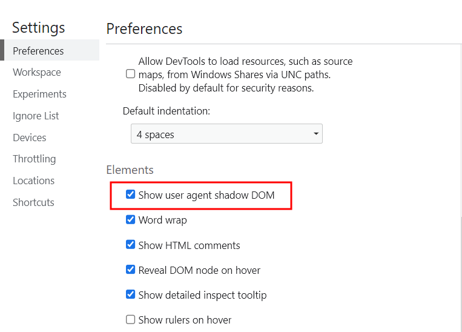
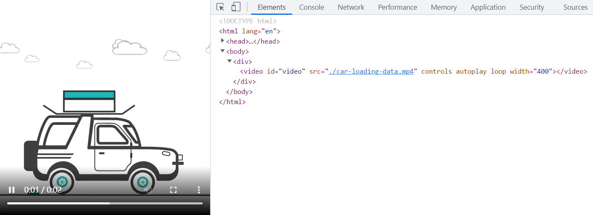
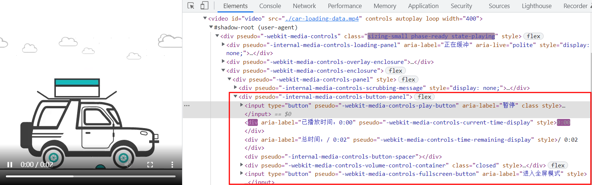
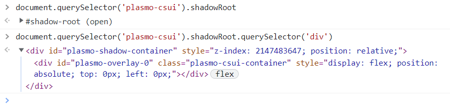
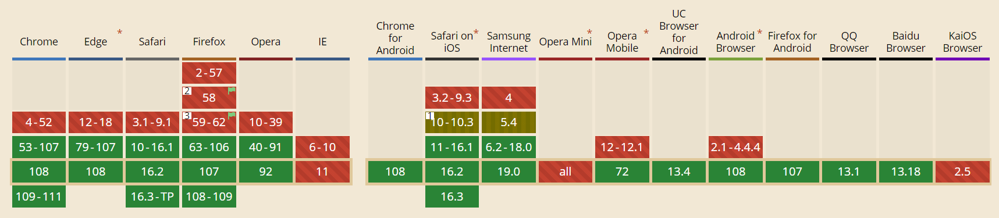

# Shadow Dom

> ### 什么是 Shadow Dom

​	Shadow Dom：影子 Dom，可以理解为潜藏在背后的 DOM 结构，也就是我们无法直接控制操做的 DOM 结构。


图中的 `#shadow-root` 中包含的内容其实就是 `Shadow-Dom`

`Shadow-Dom` 其实是浏览器的一种能力，它允许在浏览器渲染文档 `document` 的时候向其中的 `Dom` 结构中插入一棵 `DOM 元素子树`，但是特殊的是，这棵子树`Shadow-Dom 并不在主 DOM 树中`。

它相当于一个 **作用域** 的概念，使其不会被外部所影响。可以把它理解成一颗单独的dom树。这样就不会有 css 的命名冲突或者样式的意外泄漏。




通过上图方式启用开发者工具的 `Show user agent shadow DOM` 可以看到原本隐藏的结构。


> ### Shadow Dom 的构成


- `Shadow root`: Shadow tree 的根节点
- `Shadow tree`：Shadow DOM 内部的 DOM 树
- `Shadow host`：一个常规 DOM 节点，Shadow DOM 会被附加到这个节点上
- `Shadow boundary`：Shadow DOM 结束的地方，也是常规 DOM 开始的地方


我们可以使用同样的方式来操作 `Shadow DOM`，就和操作常规 `DOM` 一样，比如：

- 添加子节点、设置属性
- 为节点添加自己的样式（例如通过 `element.style` 属性）
- 为整个 Shadow DOM 添加样式（例如在 [``](https://developer.mozilla.org/zh-CN/docs/Web/HTML/Element/style) 元素内添加样式）

`Shadow DOM` 内部的元素始终不会影响到它外部的元素


> ### 为什么需要 shadow-dom

​	用 `video` 标签来举个例子：

```html
    <video
      id="video" src="./car-loading-data.mp4" controls autoplay loop width="400"
    >
    </video>
```

只需简单的一行代码，就可以实现视频播放，并且附带很多其他的功能：**暂停，播放，音量控制，全屏按钮，进度条** ...





> 这些功能的具体实现其实都在 `shadow-dom` 之中：




> ### 如何创建 Shadow Dom

​	首先需要一个 `Shadow root`，作为 `shadow` 树中最顶层的节点，是在创建 `shadow DOM` 时被附加到 常规DOM节点（`shadow host`）的内容

​	通过 `attachShadow` 方法将一个 `shadow root` 附加到任何一个元素上，并且接受一个配置对象作为参数

		- open: 表示可以通过页面内的 JavaScript 方法来获取 Shadow DOM (myCustomElem.shadowRoot)
		- closed: 不可访问 (shadowRoot 返回 null)

```js
  window.addEventListener('load', function () {
    // Shadow root
    const root = document.createElement('div')
    root.setAttribute('class', 'shadow-root')
    // 创建 Shadow Dom
    const shadow  = root.attachShadow({ mode: 'open' })
    const p = document.createElement('p')
    p.innerText = 'i am a tag inn a shadow dom'
    // 通过 DOM 操作将元素插入 Shadow Dom
    shadow.appendChild(p)
    // 将 Shadow Dom 挂载到 document
    document.body.appendChild(root)
  })
```


> #### 获取 Shadow Dom：`element.shadowRoot`




  然后就可以通过 DOM 操作，控制 Shadow Dom 中的元素

```js
document.querySelector('.shadow-root').shadowRoot
    	.querySelector('p')
    	.style.background = 'red'
```


> ### 为 `Shadow Dom` 中的元素添加样式

​	上面说过，Shadow Dom 之中是一个独立的作用域，外部无法直接影响内部元素，但可以通过以下方式添加样式：

```js
// 创建一个 style 标签
const style = document.createElement('style')
style.textContent = `
  p {
  	background: "red";
    font-size: 0.8rem;
    width: 200px;
    display: inline-block;
    border: 1px solid black;
    padding: 10px;
    border-radius: 10px;
    opacity: 0;
    transition: 0.6s all;
    position: absolute;
    bottom: 20px;
    left: 10px;
    z-index: 3;
  }
`
// 插入 shadowRoot
document.querySldocument.querySelector('.shadow-root').shadowRoot.appendChild(style)
```

需要添加其他元素也是同样，如 script..


> ### `Shadow Dom` 中的元素变化不会引起外部的注意

​	我们通过 `MutationObserver` 可以监视到 DOM 元素的变动，比如：子节点的变动、属性的变动、节点内容或节点文本的变动。。。

​	但 `Shadow Dom` 中的元素变动不会被直接监视到


```js
const container = $('.app')[0]

// 监听页面变化
const MutationObserver = window.MutationObserver
// 配置对象
const options = {
  // 是否将该观察器应用于该节点的所有后代节点
  subtree: true,
  // 子节点的变动（指新增，删除或者更改）
  childList: true,
  // 节点内容或节点文本的变动
  characterData: true,
}

// 创建MutationObserver实例，返回一个观察者对象
const mutation = new MutationObserver(function (mutationRecoards, observer) {
  if (mutationRecoards && mutationRecoards.length > 0) {
    debounce(getDataFromDom, 1000)()
  }
})
// 对观察者添加需要观察的元素，并设置需要观察元素的哪些方面
const pathname = window.location.pathname
mutation.observe(container, options);
```

由于 `Shadow DOM` 中的元素被隐藏，无法直接在主 DOM 树上观察到，这也是为 Web 组件中的 DOM和 CSS 提供的一种封装


> ### `Shadow Dom` 的兼容性

Firefox（从版本 63 开始），Chrome，Opera 和 Safari 默认支持 Shadow DOM。基于 Chromium 的新 Edge 也支持 Shadow DOM；而旧 Edge 未能撑到支持此特性




[浅谈 shadow dom](https://blog.csdn.net/qq_42872073/article/details/125607826)

[shadow dom](https://www.cnblogs.com/yf2196717/p/14732459.html)

[mdn shadow dom](https://developer.mozilla.org/zh-CN/docs/Web/Web_Components/Using_shadow_DOM)