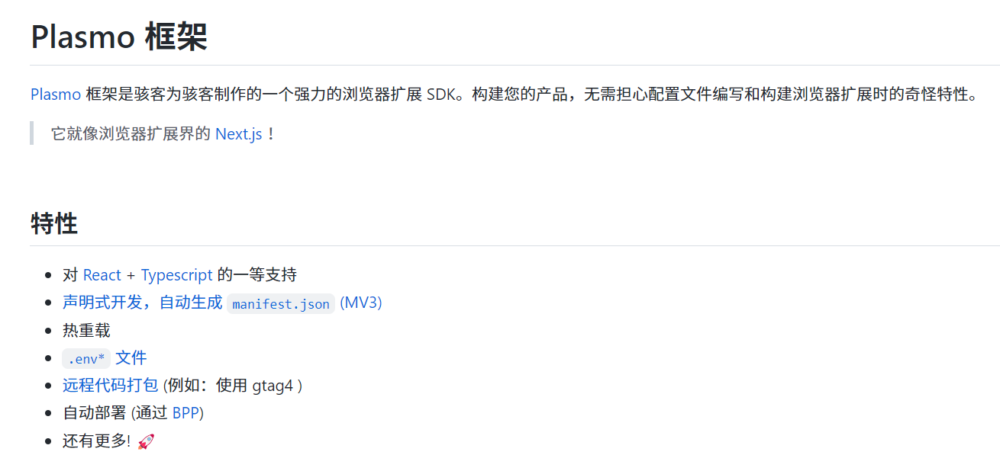
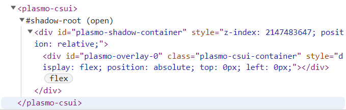

# Chrome 插件

## Chrome Extension 简介
> `Chrome Extension`：
>
> ​	用 Web 技术开发，来增强浏览器功能;
>
> ​	包括 **书签控制**、**下载控制**、**窗口控制**、标签控制、网络请求控制、各类事件监听、自定义原生菜单、完善的通信机制、等等；
>
> ​	其实就是一个由 `HTML、CSS、JS`、图片等资源组成的一个`.crx` 后缀的压缩包

如：uBlock Origin(广告屏蔽)、infinity(标签页)、tampermomkey(用户脚本增强)、DevTools...

## 插件的构成
> chrome 插件通常由以下几部分组成: 
> 	- Manifest：程序清单
> 	- Background：插件运行环境/主程序
> 	- Pop up：弹出页面
> 	- Content scripts：与浏览页面交互的脚本
> 	- Options：右键点击插件图标时展示的选项页面

### Manifest

>  每一个扩展都有一个 `JSON` 格式的 `manifest` 文件，叫 `manifest.json`，相当于程序清单，其中定义了插件的一些元数据等信息，如下：

```json
{
  "manifest_version": 3, // 版本信息 MV3
  "name": "My Extension", // 插件名称
  "description": "This is my first extension.", // 插件的描述
  "options_page": "options.html",
  "background": {
    "service_worker": "background.bundle.js" // 常驻后台脚本
  },
   // 插件弹窗的响应动作
  "action": {
    "default_popup": "popup.html",
    "default_icon": "icon-34.png"
  },
  "icons": {
    "128": "icon-128.png"
  },
  // 对页面内容进行操作的脚本
  "content_scripts": [{
    "matches": ["*://*.shopee.cn/*", "*://www.dianxiaomi.com/*"],
    "js": ["contentScript.bundle.js"],
    "css": ["content.styles.css"],
    "run_at": "document_start"
  }],
  "devtools_page": "devtools.html",
  // 普通页面能够直接访问的插件资源列表，如果不设置是无法直接访问的
  "web_accessible_resources": [{
    "resources": ["content.styles.css", "icon-128.png", "icon-34.png"],
    "matches": []
  }],
  // 插件所需要的权限
  "permissions": ["storage"]
}
```


> ### background

- background是插件的运行环境，一旦插件被启用，`chrome `就会为该插件开辟一个独立运行环境，用来执行 `background script` ；

- 一般情况下，我们会让将扩展的主要逻辑都放在 `background` 中比较便于管理。其它页面可以通过 **消息传递的机制** 与 `background` 进行通讯

​	

> >  V2 —— V3: 将 Background Scripts 改造成 Service Workers

​	在V2中，`Background` 是可以通过 `persistent` 配置来确保页面时候需要 **持久化** 。而且还能支持 `.html`

​	若设置了scripts字段，浏览器的扩展系统会自动根据scripts字段指定的所有js文件自动生成背景页。也可以直接page字段，指定背景页。**两者只能设置一个**

```js
"background": {
  "scripts": ["background-script.js"],
  "persistent": false
}

//  或
"background": {
  "page": "background-page.html",
  "persistent": false
}
```

​	>> 但在 V3 版本强制使用 Service Workers，禁止了持久化。background只能使用js文件

```js
"background": {
  "service_worker": "background.bundle.js"
},
```


> ### content-scripts

	- content-scripts 是 Chrome 插件中向页面注入脚本的一种形式（虽然名为script，其实还可以包括 css ）
	- 借助 `content-scripts` 我们可以实现通过配置的方式轻松向指定页面注入 JS 和 CSS

```json
"content_scripts": [{
  // "<all_urls>" 表示匹配所有地址
  "matches": ["https://pgy.xiaohongshu.com/solar/blogger-detail/*", "https://pgy.xiaohongshu.com/solar/advertiser/kol/*"],
  // // 多个JS按顺序注入
  "js": ["bloggerDetail.d67cf2cb.js"],
  // 代码注入的时间，可选值： "document_start", "document_end", or "document_idle"，最后一个表示页面空闲时，默认document_idle
  "run_at": "document_start",
  // css 的注入需注意 影响全局
  "css": ["css/custom.css"]
}]
```

如果没有主动指定 `run_at` 为 `document_start`（默认为`document_idle`），下面这种代码是不会生效的

```js
// HTML 文档解析完成，不需要等待样式表、图片等资源
// 同 $(document).ready(fn)
document.addEventListener('DOMContentLoaded', function()
{
	console.log('我被执行了！');
});
```


`content-scripts` 和原始页面共享 DOM，但是不共享 JS，不能访问该页面脚本定义的变量和方法；

如要访问页面 JS（例如某个JS变量），只能通过 `injected js` 来实现

只有为要访问的页面赋予权限才可以，需在 Manifest 中添加 permissions 节点


> ### permissions

字符串数组，用来声明插件需要的权限，这样才能调用某些 chrome API，常见的有：

 - tabs // 已打开标签的列表
 - activeTab // 活动标签
 - contextMenus // 网页右键菜单
- storage // 存储，并非 localStorage
- history
- cookies

```js
// storage 
chrome.storage.local.get(['key'])
chrome.storage.local.set({
    key: value
})
```

## 消息通信

- ##### 发送消息

  - 内容脚本到主程序

    ```js
    chrome.runtime.sendMessage(
      { from: 'content', msg: 'UPDATE_CONFIG' },
      function (response) {
        console.log('收到来自后台的回复：' + response);
      }
    );
    ```

  - 主程序到内容脚本

    ```js
        chrome.tabs.query(
          {
            currentWindow: true,
          },
          function (tabs) {
            tabs.forEach((tab) => {
              chrome.tabs.sendMessage(tab.id, {
                from: 'background',
                msg: 'RATE_AND_FREIGHT_UPDATED',
                data: message.data,
              });
            });
          }
        );
    ```

- ##### 接收消息

  ```js
  chrome.runtime.onMessage.addListener(async (message, sender, sendResponse) => {
    if (message.msg === 'UPDATE_CONFIG') {
  	console.log(message.data)
    }
  })
  ```

  
## Chrome API
除了web本身的API以外，Chrome插件还支持一些独有的API可供使用

- 


## Chrome 扩展开发模板框架

> #### chrome-extension-boilerplate-react

[Github url：chrome-extension-boilerplate-react](https://github.com/lxieyang/chrome-extension-boilerplate-react)

​	这是一个基本的 `Chrome Extensions` 模板，通过 Webpack 的基本配置，帮助我们编写模块化的现代 Javascript 代码，轻松加载 CSS，并在代码更改时自动重新加载浏览器。


支持：

  - [Chrome Extension Manifest V3](https://developer.chrome.com/docs/extensions/mv3/intro/mv3-overview/)
  - [React 17](https://reactjs.org/)
  - [Webpack 5](https://webpack.js.org/)
  - [Webpack Dev Server 4](https://webpack.js.org/configuration/dev-server/)
  - [React Hot Loader](https://github.com/gaearon/react-hot-loader)
  - [eslint-config-react-app](https://www.npmjs.com/package/eslint-config-react-app)
  - [Prettier](https://prettier.io/)
  - [TypeScript](https://www.typescriptlang.org/)

> #### Plasmo Framework



[https://github.com/PlasmoHQ/examples](https://github.com/PlasmoHQ/examples)
提供了许多官方模板，可以根据自己想要的功能进行开发，并且提供各种框架使用，比如：Vue、NextJs、svelte、Antd、redux...


#### 安装及目录
```bash
pnpm create plasmo
# OR
yarn create plasmo
# OR
npm create plasmo
```

```js
- .plasmo
- assets
- build
- popup.tsx
- package.json
- .prettierrc.cjs
- .gitignore
- README.md
- tsconfig.json
```

可见没有最主要的 `manifest.json` 文件，因为 Plasmo 框架帮我们自动完成这项配置，无需显式的声明。

当然也可以在 package.json 自定义，将重载
```json
{
  "manifest": {
    "action": [],
    "host_permissions": []
  }
}
```

#### Plasmo 提供的一些库和功能

1. #### `ContentScript`
内容脚本，和页面共用 window，支持多个脚本，每个都是独立的

```js
import type { PlasmoContentScript } from "plasmo"
 
export const config: PlasmoContentScript = {
  matches: ["<all_urls>"],
  css: []
}

window.addEventListener("load", () => {
  console.log("content script loaded")

  document.body.style.background = "pink"
})
```

2. #### `Content Scripts UI`
内容脚本UI，可以将React、Vue、Svelte 组件挂载到页面上

```js

import cssText from "data-text:~/contents/plasmo-overlay.css"
 
export const getStyle = () => {
  const style = document.createElement("style")
  style.textContent = cssText
  return style
}

const PlasmoInline = () => {
  return <button>Custom button</button>
}
 
export default PlasmoInline
```

挂载后再 DOM 文档中可见：


> 也可不用 Plasmo 提供的 CSUI，因为他的挂载方式都是通过 ShadowDom 来实现的，我们不能直接通过 DOM 方式直接操作 ShadowDom 中的元素，而且其中的元素挂载时机也不好把握，所以可以自己挂载

```js
import { createRoot } from 'react-dom/client';

const dom = document.createElement('div')
$(dom).addClass('tl-message-root')

document.body.appendChild(dom)

createRoot(dom).render(<Message message={'复制成功'} />)
```

3. #### `@plasmohq/storage`

> @plasmohq/storage 是一个来自 plasmo 的实用程序库，它抽象了浏览器扩展可用的持久存储 API。当扩展存储 API 不可用时，它会回退到本地存储，允许在弹出窗口 - 选项 - 内容 - 背景之间进行状态同步。

```js
import { Storage } from "@plasmohq/storage"
 
const storage = new Storage()
// 或
const storage2 = new Storage({
  area: "local" // 将存储到 localStorage
})
 
await storage.set("key", "value")
 
const data = await storage.get("key") // value
```

可以通过 `Hook` 方式使用

```js
import { useStorage } from "@plasmohq/storage/hook"

const [hailingFrequency, , {
  setRenderValue,
  setStoreValue,
  remove
}] = useStorage("hailing")
```

4. #### 一些比较特殊的标记符 `url: data-text:~ data-base64:~`

```js
// 页面 css 注入
import cssText from "data-text:~/contents/plasmo-overlay.css"

import someCoolImage from "data-base64:~assets/some-cool-image.png"

export const getStyle = () => {
  const style = document.createElement("style")
  style.textContent = cssText
  return style
}
```

> `getStyle` 方法的作用是在 ShadowDom 当中插入 style 标签的形式注入 css，否则直接在页面引入的样式不起作用，这也是 ShadowDom 的特点之一


参考：
- [Plasmo 官方文档](https://docs.plasmo.com/)
- [Plasmo 官方模板](https://github.com/PlasmoHQ/examples)
- [chrome V3插件入门到放弃，Plasmo不完全使用指南](https://blog.csdn.net/Jioho_chen/article/details/126672461)
- [【干货】Chrome插件(扩展)开发全攻略](http://blog.haoji.me/chrome-plugin-develop.html)
- [巨坑：chrome extensions绝对不要升级到V3](https://www.pudn.com/news/6274e4908dbc4529de74c541.html)


