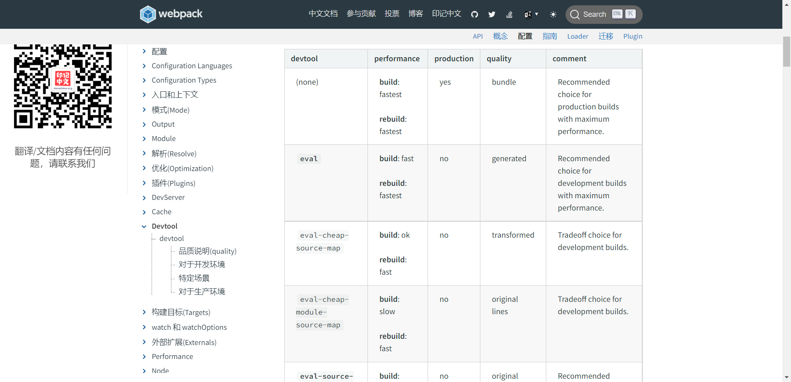

# Webpack2 升级 Webpack4 及编译打包优化技巧


- node 环境：node@:10.5.0
- 包管理：yarn@1.22.9

## Webpack2 升级 Webpack4

### 1. 升级 webpack
```bash
yarn add webpack@4
```

### 2. 升级 webpack 相关插件
- `webpack-bundle-analyzer` 代码分析插件

  此插件功能为：
    读取输出文件夹（通常是 dist）中的 stats.json 文件，把该文件可视化展现，生成代码分析报告，可以直观地分析打包出的文件有哪些，及它们的大小、占比情况、各文件 Gzipped 后的大小、模块包含关系、依赖项等，对应做出优化，从而帮助提升代码质量和网站性能

  需要配合 webpack 和 webpack-cli 一起使用

  [webpack-bundle-analyzer 插件配置](https://blog.csdn.net/weixin_50836306/article/details/123131163)

  

- `webpack-dev-server`

  使用 `webpack-dev-server` 替换早先的 `webpack-dev-middleware` 与 `webpack-hot-middleware`

  `webpack-dev-middleware` 用于 生成一个与 webpack 的 compiler 绑定的中间件，并在本地搭建一个 express 服务，然后在服务中调用中间件；

  `webpack-hot-middleware` 则是一个用于热更新的中间件

  

  这两个插件在早先的用处是，代替 webpack 本身的 watch-mode，因为 watch-mode 会直接打包到本地，而 `webpack-dev-middleware` 快速编译走的是内存

  `webpack-dev-server` 则相当于：express + `webpack-dev-middleware` + `webpack-hot-middleware`，可以用于伺服，实时编译无输出文件

  

- `webpack-merge`

  `webpack-merge` 用于合并配置，我们通常将开发环境与生产环境抽离为不同的配置文件，然后可以通过 `webpack-merge` 生成完整的配置
  
  


- `terser-webpack-plugin`

​		项目原先使用的是 `webpack-parallel-uglify-plugin` 插件，这个插件是用于加速打包优化压缩，webpack 默认提供了 UglifyJS 来压缩 js 代码，但是这是单	线程的，只能一个个排队进行；而 `webpack-parallel-uglify-plugin` 插件则会开启多个子进程，并行处理多个子任务，效率提高

​		但是 `webpack-parallel-uglify-plugin` 并不是由官方维护并且 2 年未更新，所以使用 `terser-webpack-plugin` 替换

​		和 `ParallelUglifyPlugin` 一样，并行处理多个子任务，效率会更加的提高，且是 webpack4 官方推荐，有专人维护，并且连配置的方式都可以直接在		optimization 中配置


- `mini-css-extract-plugin`

  webpack4 之前使用 `extract-text-webpack-plugin` 插件把 css 养生从 js 中抽离出来，而 v4 版本，官方推荐使用 `mini-css-extract-plugin` 插件来打包 css 文件，它可以提取 css 代码到单独的文件中，对 css 代码进行压缩


- `optimize-css-assets-webpack-plugin` CSS 模块资源优化插件，也可以进行压缩


- `html-webpack-plugin`

  此插件的作用是：
    1. 创建 html 入口文件
  
    2. 为 html 文件引入外部的资源如：script、link
  
       


- `script-ext-html-webpack-plugin`

  与 `optimization.runtimeChunk` 配置配合使用

    runtimeChunk 用于运行时代码单独打包，如异步加载路由

    但是 runtime 代码由于只是驱动不同路由页面的关系，代码量比较少，请求 js 的时间都大于执行时间了，所以使用 script-ext-html-webpack-plugin 插件将其内链在 index.html 中比较友好


## 编译打包优化技巧

### 开发环境

> #### devtool

  用于配置 source map，source map 用于映射编译后的代码与源码，如果编译后的代码报错，就可以快速的定位到出错的位置

  [webpack 文档](https://webpack.docschina.org/configuration/devtool/#development) 中可见 source map 有数十种值可以设置

  

  但仔细观察就会发现是有规律的，大部分是以 eval、inline、cheap、module 这四种开头

| 参数   | 参数解释                                                     |
| ------ | ------------------------------------------------------------ |
| eval   | 通过 eval 函数执行文件内容，行映射可能不准；且不产生独立的 map 文件 |
| cheap  | map 映射只显示行，不显示列，忽略来自 loader 的 source map    |
| inline | 映射文件以 base64 格式编码，加在 bundle 文件最后；不产生独立的 map 文件 |
| module | 增加对 loader source map 和第三方模块的映射                  |


常用配置推荐：
1. `source-map`
    大而全，但是会导致构建的时间长

2. `cheap-module-eval-source-map`
    推荐开发环境 develop 使用，构建速度与报错比较均衡

3. `cheap-module-source-map`
    一般来说，生产环境是不配置 devtool 的，如果想捕捉显示代码报错，可以使用 `cheap-module-source-map`


> #### devServer

  devServer 是 webpack 提供的本地开发服务器，会自动监听变化，自动打包构建，自动更新刷新浏览器

  特点：
  - 不会产生dist文件，将打包结果暂时存在内存中，内部的 http-sever 访问这些文件并读取数据，发送给浏览器
  - 减少磁盘的读取，提高构建效率

  ```js
    // these devServer options should be customized in /config/index.js
    devServer: {
      useLocalIp: true,
      clientLogLevel: 'warning', // 浏览器控制台输出的热更新信息
      historyApiFallback: true, // 单页面程序 刷新浏览器会出现404，缘由是它经过这个路径（好比： /search/list）来访问后台，因此会出现404，而把historyApiFallback设置为true那么全部的路径都执行index.html
      hot: true, // hmr
      compress: true, // 压缩
      host: HOST,
      port: PORT,
      open: config.dev.autoOpenBrowser,
      overlay: config.dev.errorOverlay
        ? { warnings: false, errors: true }
        : false,
      publicPath: config.dev.assetsPublicPath,
      proxy: config.dev.proxyTable,
      quiet: true, // necessary for FriendlyErrorsPlugin
      watchOptions: { // 监听文件变化
        poll: config.dev.poll // poll: 1000 每秒检查一次变动
      },
    },
  ```

  需要开启 `HotModuleReplacementPlugin` 插件打开热模块替换功能

  ```js 
  plugins: [
    new Webpack.HotModuleReplacementPlugin(),
  ]
  ```

### 生产环境

> #### optimization

  optimization 优化，从 webpack 4 开始，会根据你选择的 mode 来执行不同的优化， 不过所有的优化还是可以手动配置和重写

##### minimizer

  在 Webpack 4 中，通过两个配置字段控制压缩过程：`optimization.minimize` 字段切换压缩处理器，而 `optimization.minimizer` 数组用来配置压缩处理器

  1. TerserJSPlugin

  [terserOptions 配置](https://github.com/terser/terser#minify-options)

  ```javascript
  optimization: {
    minimizer: [
      new TerserJSPlugin({
        parallel: 4, // 多线程并行打包
        cache: true, // 开启缓存
        terserOptions: {
          ecma: 5,
          warnings: false,
          parse: {},
          mangle: true, // Note `mangle.properties` is `false` by default.
          module: false,
          output: null,
          toplevel: false,
          nameCache: null,
          ie8: false,
          keep_fnames: false,
          safari10: true,
          compress: {
            warnings: true,
            drop_debugger: true, // 删除debugger
            drop_console: true  // 删除console
          }
        }
      }),
    ]
  }
  ```

  2. OptimizeCSSAssetsPlugin

  ```js
  optimization: {
    minimizer: [
      new OptimizeCSSAssetsPlugin() // 使用默认配置即可
    ]
  }
  ```


##### splitChunks

  从 Webpack4 开始官方移除了 CommonChunkPlugin 插件，改用了 optimization 属性进行更加灵活的配置

  `CommonChunkPlugin` 是用于公共模块的拆分，为了将一些很少变化的常用库（react、redux、lodash）与业务代码分开，或者是一些不同入口共同使用的公共模块，开发者常常需要将它们单独打包，这些都可以通过配置 CommonsChunkPlugin 来实现

  简单来说，`CommonsChunkPlugin` 的作用主要体现在代码分割和性能优化上，主要有如下几个方面：

  - 提取常用库代码
  - 提取公有代码
  - 提取 webpack 的 runtime (运行时) 代码


  webpack 4 准备通过 `optimization.splitChunks` 和 `optimization.runtimeChunk` 属性来简化代码分割的配置

```js
/**
 * webpack中实现代码分割的两种方式：
 * 1.同步代码：只需要在webpack配置文件总做optimization的配置即可
 * 2.异步代码(import)：异步代码，无需做任何配置，会自动进行代码分割，放置到新的文件中
 */
optimization: {
  runtimeChunk: true, // 运行时代码单独打包
  splitChunks: {
    chunks:'all', // 同时分割同步和异步代码,推荐
    minSize: 30000,           // 字节 引入的文件大于30kb才进行分割
    maxSize: 50000,         // 50kb，尝试将大于50kb的文件拆分成n个50kb的文件
    minChunks: 1,             // 模块至少使用次数
    maxAsyncRequests: 5,      // 同时加载的模块数量最多是5个，只分割出同时引入的前5个文件
    maxInitialRequests: 3,    // 首页加载的时候引入的文件最多3个
    automaticNameDelimiter: '~', //缓存组和生成文件名称之间的连接符
    name: true,                  //缓存组里面的filename生效，覆盖默认命名
    cacheGroups: { // 缓存组，将所有加载模块放在缓存里面一起分割打包
      //自定义打包模块
      vendors: {
        test: /node_modules/, // 引node_modules中的才会抽离到vendor
        chunks: 'initial',
        name: 'vendor',
        priority: 10 // 提高优先级，会先抽离 vendor
      },
      elementUI: {
        name: 'chunk-elementUI', // 单独将 elementUI 拆包
        priority: 20, // 权重要大于 libs 和 app 不然会被打包进 libs 或者 app
        test: /[\\/]node_modules[\\/]element-ui[\\/]/,
      },
      commons: { // commons优先级默认比vendor高
        chunks: 'initial',
        name:'commons',
        minSize: 0, // 只要超出0字节就生产新的包
        minChunks: 1 // 最小使用的次数
      },
      styles: {
        name: 'styles',
        test: /\.css$/,
        chunks: 'all',
        enforce: true,
        priority: 20,
      }
    }
  }
}
```

> #### plugins

  使用插件对现有架构进行扩展，比如打包优化，文件压缩等等

  ##### DefinePlugin

  DefinePlugin 允许你创建可在编译时配置的全局常量，这对需要再开发环境构建和生产环境构建之间产生不同行为来说非常有用

  ```js
  // webpack.prod.conf.js
  plugins: [
    new Webpack.DefinePlugin({
      'process.env': config.build.env,
      BUILDTIME: config.buildTime
    }),
  ]
  ```

  ##### MiniCssExtractPlugin

  webpack4 推荐使用 MiniCssExtractPlugin 插件替代 extract-text-webpack-plugin，来提取项目中引入的样式文件，打包到单独的文件中
  ```js
  // webpack.prod.conf.js
  plugins: [
    // extract css into its own file
    new MiniCssExtractPlugin({
      filename: utils.assetsPath('css/[name].[contenthash:8].css'),
      chunkFilename: utils.assetsPath('css/[name].[contenthash:8].css'),
      ignoreOrder: true // 不显示 css 引入顺序警告
    }),
  ]
  ```

  ##### HtmlWebpackPlugin

  该插件能够自动生成一个index.html文件（可以指定模板来生成），还能够将打包的js文件，自动通过scripts标签插入到body中。

  ```js
  // webpack.prod.conf.js
  plugins: [
    new HtmlWebpackPlugin({
      filename: config.build.index,
      template: 'index.html',
      inject: true,
      minify: {
        removeComments: true,
        collapseWhitespace: true,
        removeAttributeQuotes: true
        // more options:
        // https://github.com/kangax/html-minifier#options-quick-reference
      }
    }),
  ]
  ```

  ##### 其他
  ```js
  // webpack.prod.conf.js
  plugins: [
    new Webpack.HashedModuleIdsPlugin(), // 模块增加标识，开发环境建议用 NamedModulePlugin
    // 清理打包后的 dist
    new CleanWebpackPlugin(['dist'], {
      root: path.join(__dirname, '..')
    }),
    // 用于拷贝一些没有在其他模块使用到的的文件到输出目录，而 loader 又不适合做这件事
    new CopyWebpackPlugin([
      {
        from: path.resolve(__dirname, '../static'),
        to: config.build.assetsSubDirectory,
        ignore: ['.*']
      }
    ])
  ]
  ```


  > 打包后上传至 oss 发现字体文件下载失败报错 跨域问题

    使用 loader 处理字体文件时，使用 url-loader 直接生成独立的字体文件，会出现跨域问题，如果转成 base64 则不会跨域

### 参考

- [webpack 官方文档 v4](https://v4.webpack.docschina.org/configuration/)
- [devtool](https://blog.51cto.com/u_15162069/2784538)
- [webpack devtool](https://webpack.docschina.org/configuration/devtool/#development)
- [webpack4 配置到优化](https://www.jianshu.com/p/5279f4b1d454)
- [webpack4 optimization 介绍](https://www.imeetyou.net/post/2020/webpac4-optimization/)