# Whistle && SwitchyOmega

> Whistle 是基于 Node 实现的跨平台 web 调试代理工具，类似 Windows 平台的 Fiddler，可以查看、修改 HTTP、HTTPS、WebSocket的请求、响应。
  也可以作为HTTP代理服务器使用。

特点：

1. 完全跨平台：支持 Mac、Windows 等桌面系统，且支持服务端等命令行系统
2. 功能强大：

- 支持作为 HTTP、HTTPS、SOCKS 代理及反向代理
- 支持抓包及修改 HTTP、HTTPS、HTTP2、WebSocket、TCP 请求
- 支持重放及构造 HTTP、HTTPS、HTTP2、WebSocket、TCP 请求
- 支持设置上游代理、PAC 脚本、Hosts、延迟（限速）请求响应等
- 支持查看远程页面的 console 日志及 DOM 节点
- 支持用 Node 开发插件扩展功能，也可以作为独立 npm 包引用

3. 操作简单

- 直接通过浏览器查看抓包、修改请求
- 所有修改操作都可以通过配置方式实现（类似系统 Hosts），并支持分组管理
- 项目可以自带代理规则并一键配置到本地 Whistle 代理，也可以通过定制插件简化操作


> ### 安装与使用

全局安装：

```bash
$ npm i -g whistle
```

查看帮助

```bash
$ w2 help
 Usage: whistle <command> [options]
 Commands:
    status      Show the running status
    add         Add rules from local js file (.whistle.js by default)
    proxy       Set global proxy
    ca          Install root CA
    install     Install whistle plugin
    uninstall   Uninstall whistle plugin
    exec        Exec whistle plugin cmd
    run         Start a front service
    start       Start a background service
    stop        Stop current background service
    restart     Restart current background service
    help        Display help information
 Options: 
  	...
```

启动 whistle 服务

```bash
$ w2 start
[i] whistle@2.9.40 started
[i] 1. use your device to visit the following URL list, gets the IP of the URL you can access:
       http://127.0.0.1:8899/
       http://192.168.145.1:8899/
       http://192.168.222.1:8899/
       http://192.168.51.24:8899/
       Note: If all the above URLs are unable to access, check the firewall settings
             For help see https://github.com/avwo/whistle
[i] 2. set the HTTP proxy on your device with the above IP & PORT(8899)
[i] 3. use Chrome to visit http://local.whistlejs.com/ to get started
```

浏览器访问其中一个 ip 地址即可查看抓包、修改请求等。

> ### 配置代理

1. 全局代理

   ```bash
   $ w2 proxy // 设置全局代理
   $ w2 proxy off // 关闭全局代理
   ```

2. 如果不想使用全局代理，即可使用 [SwitchyOmega](https://chrome.google.com/webstore/detail/padekgcemlokbadohgkifijomclgjgif) 插件进行代理设置管理

   - 插件安装完成后，新建情景模式，命名为 whistle
   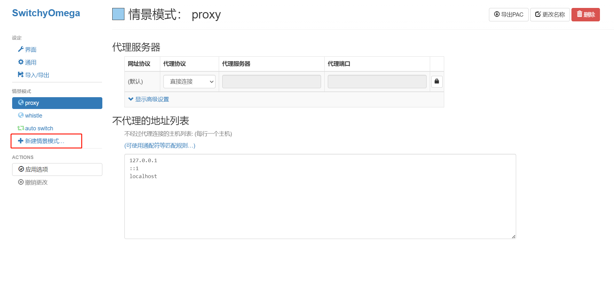
   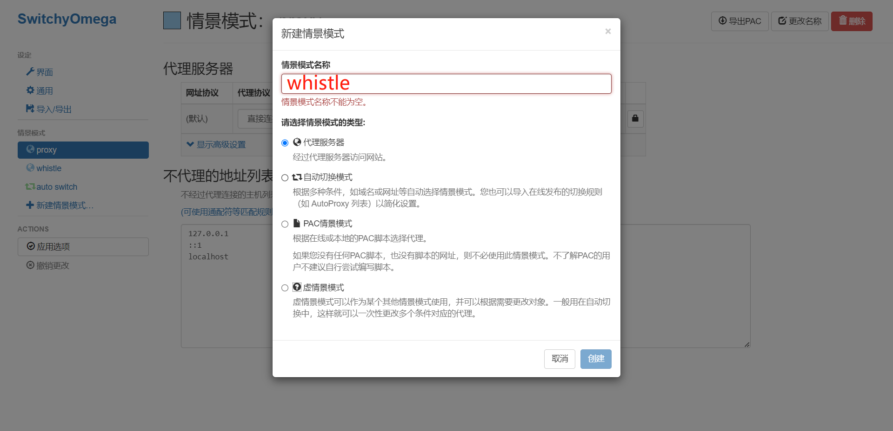
   - 选择 whistle 模式，填写 whistle 服务的 ip、端口
   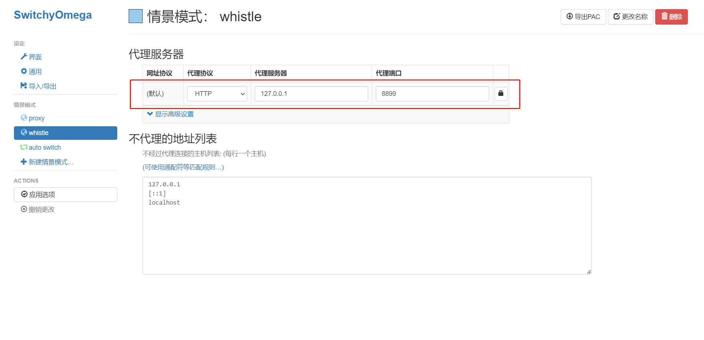
   - 选择 auto switch 模式，填写切换规则，如：对 `192.168.111.111 ` ip使用 whistle 规则
   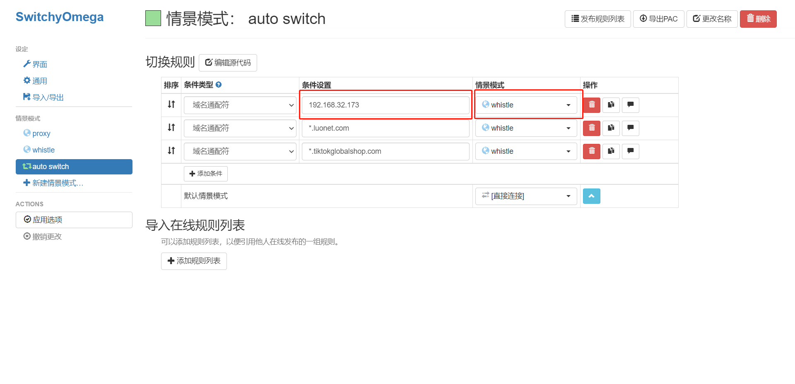
   - 完成后点击应用选项，点击 插件图标打开 popup，选择 whistle 模式，即可正常抓包
   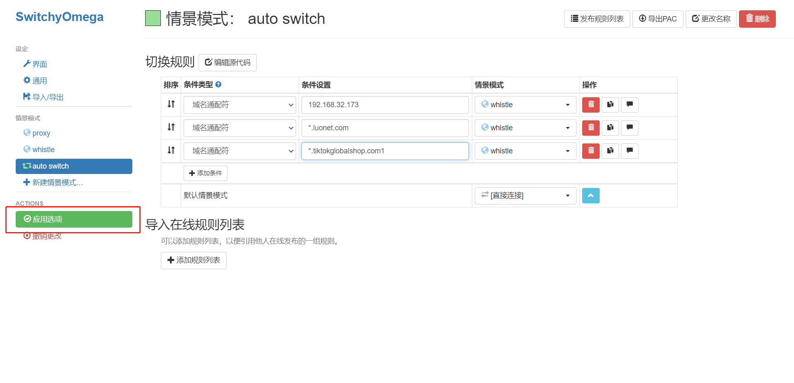
   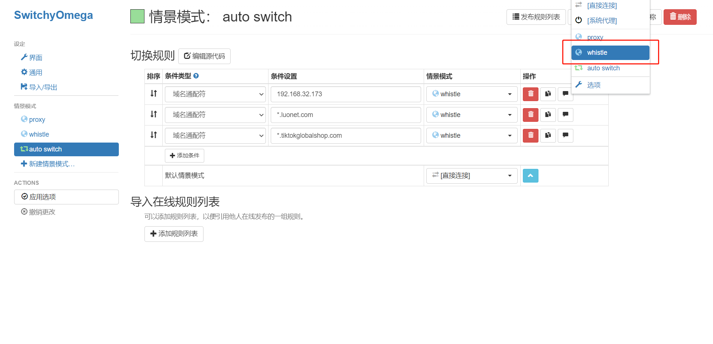
   - whistle 服务可见接口列表及抓包详情
   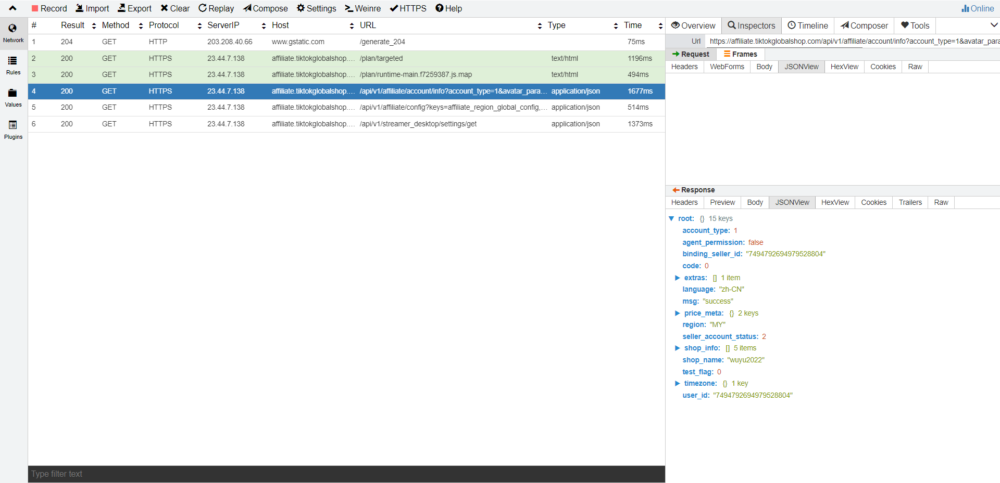
   
   > ##### 抓取本地服务

   如果你想抓取本地服务器启动的网站应用，比如127.0.0.1 或 localhost 这样的网页，清空不代理的地址列表，并添加 `<-loopback>`，即可正常抓包
   
   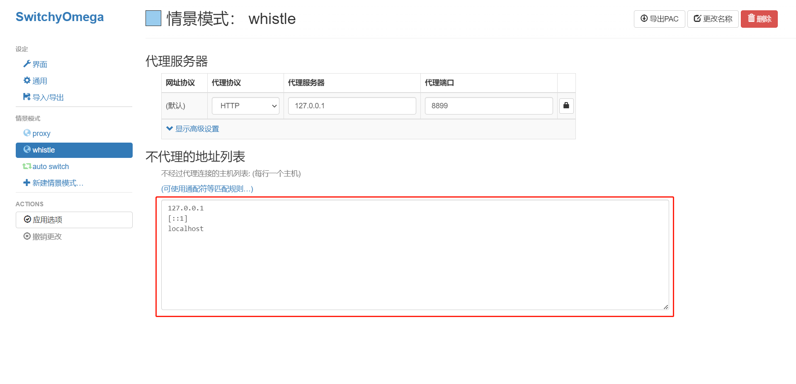

   > ##### HTTPS 请求需要安装证书

   点击上方菜单栏 `HTTPS` 选项，勾选两个选项后，点击二维码下载 CA 证书，然后安装证书

   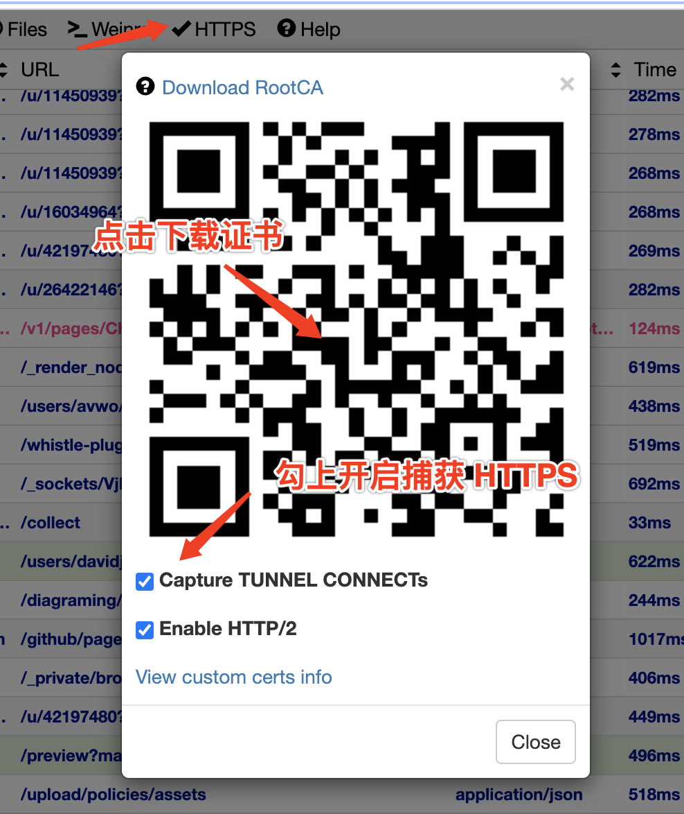


> ### 移动端

Whistle 对于移动端可以进行抓包及查看 DOM 结构、样式、控制台打印信息等

1. 配置

- PC 与 手机处于同一个局域网内
- 手机进行代理设置，设置主机名为 PC 端 ip 地址或打开 Whistle 服务的 ip 地址，端口设置为 Whistle 服务端口 8899
   以下是 MIUI 网络设置参考
   <center>
      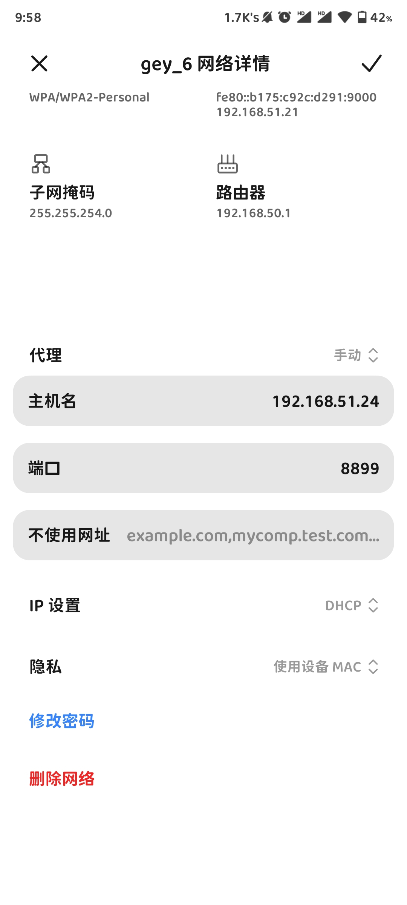
   </center>

- 打开前面打开过的二维码手机扫码下载安装证书，或手机打开 PC 端 Whistle 同样的地址，点击 HTTPS 选项安装证书，操作与 PC 相同
   或者查看 [官方文档](http://wproxy.org/whistle/webui/https.html)
- 证书安装完成后即可在 PC 端或移动端查看抓包信息


2. 查看移动端 DOM 及其他信息

​	通过内置的 `Weinre` 可以查看移动端 DOM 及样式

- 侧边栏选择 Rules 选项，填入想要在移动端抓包的网站，并给 `Weinre` 命名如 test
   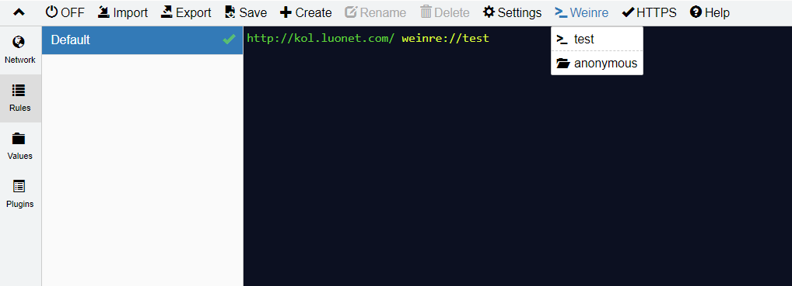
- 点击顶部选项卡 Weinre 选项，选择命名的 test
   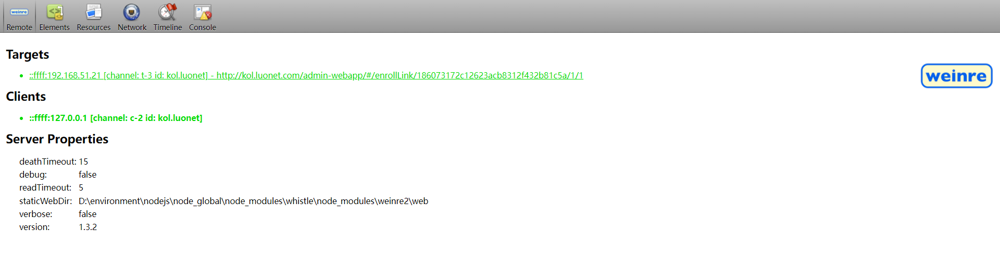
- 在新的页面中即可看到 DOM 信息及 console 信息

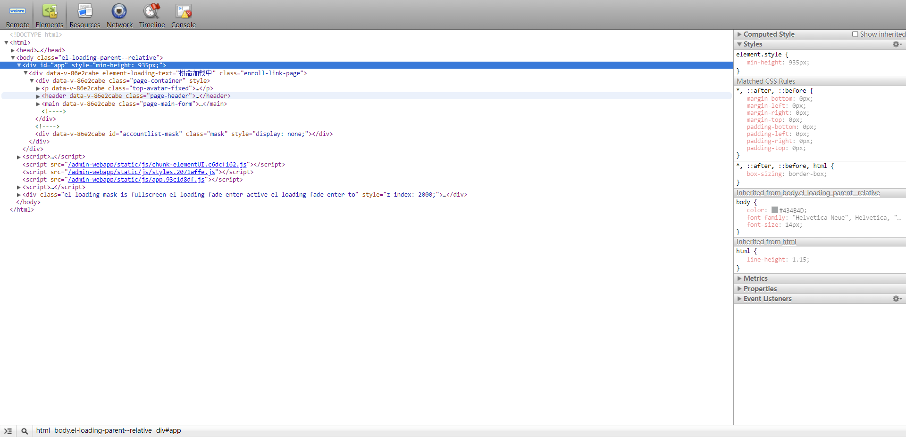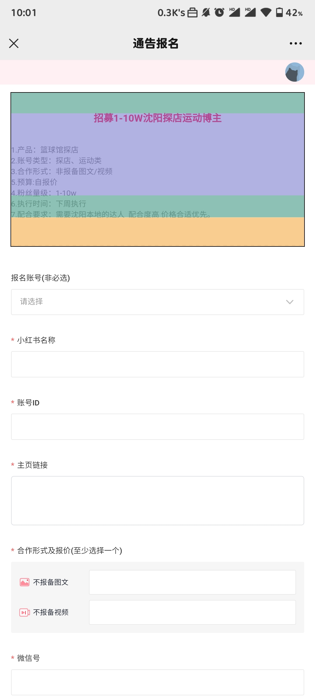


> ### 其他功能

   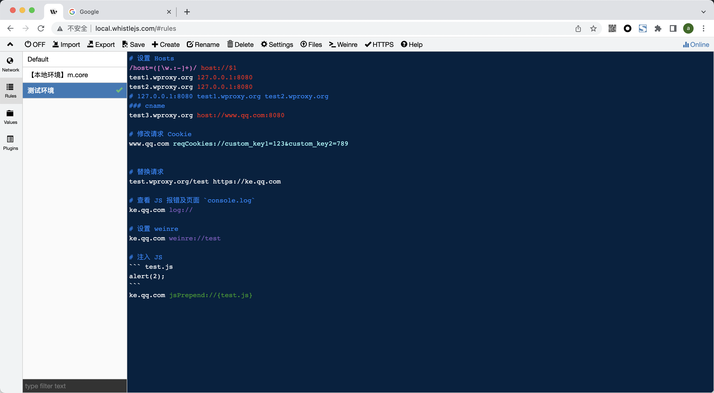

  Whistle 的功能不仅仅是抓包，还有其他丰富的功能诸如：

​	js 注入、数据劫持、替换请求、替换返回内容、跨域处理、mock 数据

   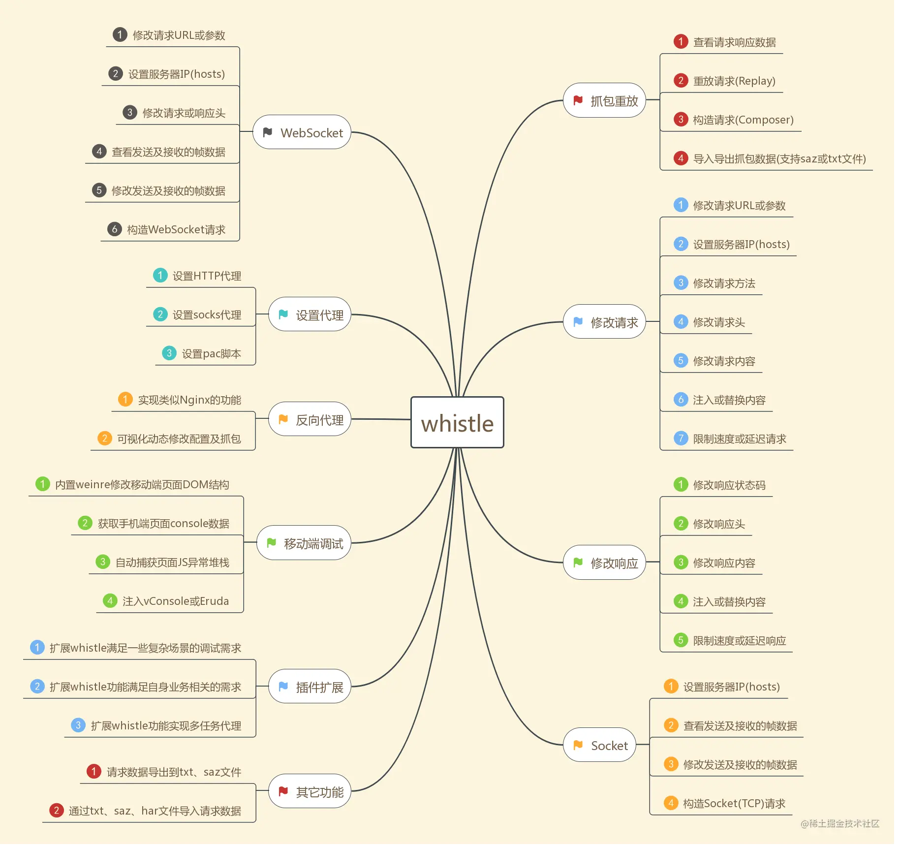

> ### 对比抓包工具

   大部分人使用的抓包工具都是 Charles、Fiddler 之类的，相较于这些老牌抓包软件，Whistle 也有它独到的地方：

	- 开源且免费
	- 轻量且易于安装，Whistle 基于 Node，安装就是全局安装 npm 包，对于前端开发更加友好；大小也就 2.7m，而软件安装至少几十m
	- 配置操作同样简单，配置几种且灵活，操作友好
	- 可以自由开发插件


> ### 文档
- [官方文档](http://wproxy.org/whistle/install.html)
- [前端抓包](https://juejin.cn/post/7140040425129115684)