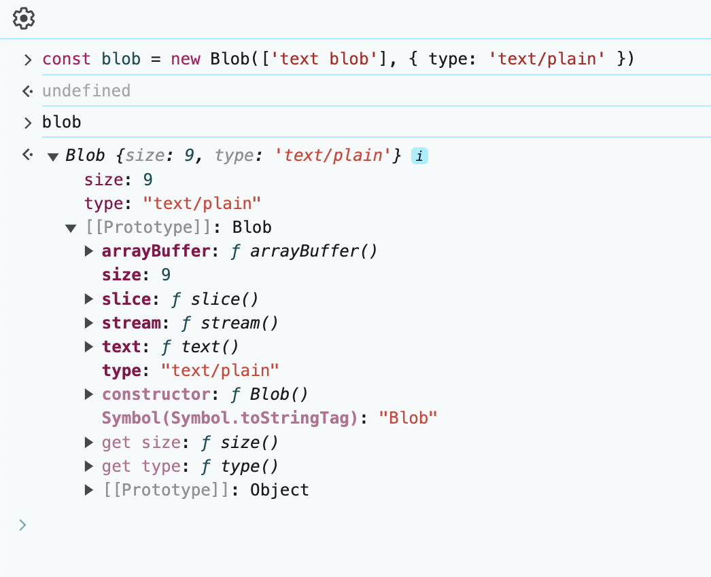
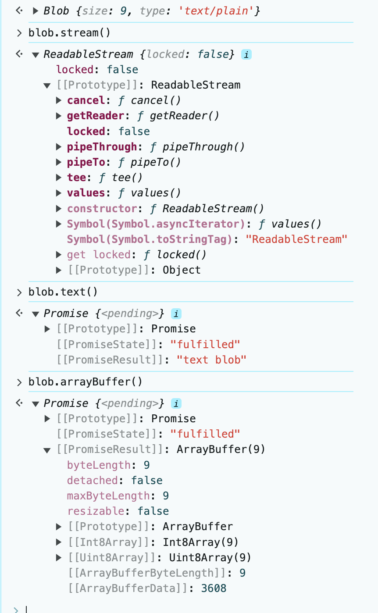

# 前端中的二进制流

## data url

base64: 二进制格式的数据，如图片 `data:image/png;base64,iVBORw0KGgoAAAANSU...`

## blob 对象

> `binary large object` 二进制大对象，是一个可以存储二进制文件的**容器**（只是容器）

Blob 由字符串 type 和 blobParts 组成，其中 type 通常为 MIME 类型
```js
const blob = new Blob(['blob text'], {
  type: 'text/plain'
})
```


- size: 只读，表示 Blob 实例中包含数据的大小，单位是字节
- type: 只读，表示 Blob 实例所存放数据的 MIME 类型，如果不传则为空字符串

- slice方法：对 blob 对象进行切割，返回一个新的 blob，一般大数据分片上传时会用到
- stream方法：返回一个能读取 blob 中内容的 ReadableStream




[前端二进制数据流](https://juejin.cn/post/7100759219397197831)