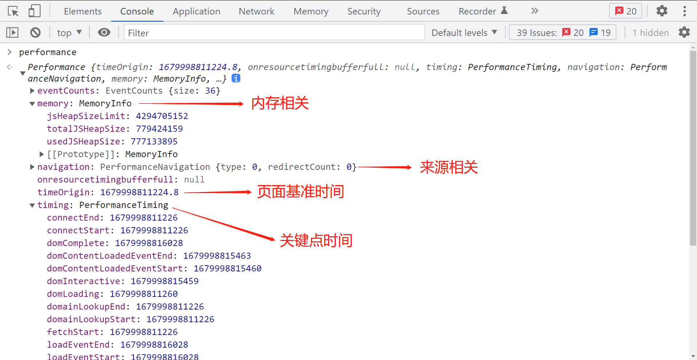
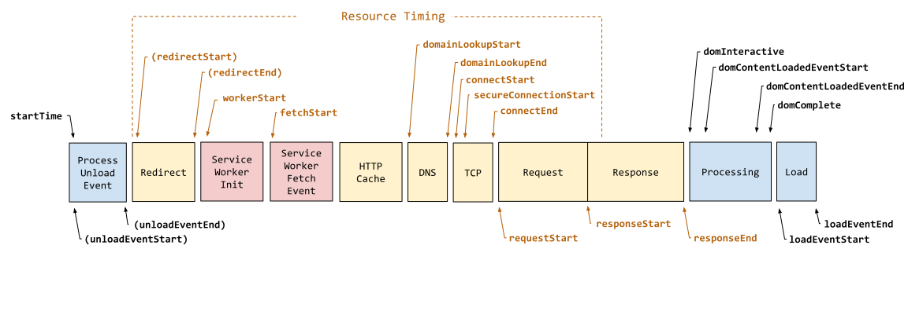

## 前端性能监控与数据收集埋点

> 页面的性能问题是前端开发中一个重要环节，对于提升用户体验至关重要。


### 前端性能监控指标
- 白屏时间
用户看到页面展示出现一个元素的时间，也可叫做首次渲染时间

可以取 `responseStart - navigationStart`，此时页面开始解析 DOM 树，页面渲染的第一个元素也会很快出现
或 `responseStart - startTime`

- 首屏时间
首屏时间是指页面第一屏所有资源完整展示的时间

可以取 `domContentLoadedEventEnd - fetchStart`，或是 `loadEventStart - fetchStart`，此时 `DOM` 树解析完成，并显示内容

- 页面 onload 时间
指 DOM load 事件被触发完成，即 DOM 渲染完成

可以取 `domContentLoadedEventEnd - navigationStart`，或是 `domContentLoadedEventEnd - startTime`


- DNS 解析时间
- TCP 建立时间
- 重定向耗时


### window.performance

> window.performance 是 W3C 引入的一个 API 可以用于检测页面性能。目前 IE9 以上的浏览器都支持。是一个浏览器中用于记录页面加载和解析过程中关键时间点的对象




1. performance.memory 显示的是此刻内存的占用情况，是一个动态值
2. performance.navigation 显示的是页面的来源信息，如 `redirectCount` 是重定向的次数，默认为 0；`type` 则是页面打开的方式，如正常进入、reload等
3. performance.timeOrigin 是一系列时间点的基准点，精确到万分之一毫秒
4. performance.timing 包含一系列的关键时间点，包含网络、解析等一系列的数据

> performance.timing 在将来可能会被废弃，可以使用 PerformanceNavigationTiming 作为替代品


### PerformanceNavigationTiming(performance.timing)



上图是 MDN 上最新的时间参数对照图，本文将使用 `PerformanceNavigationTiming` 对象来监测页面性能时间点变化

使用 `getEntriesByType` 方法获取特定的资源数据
```js
const timing = performance.getEntriesByType('navigation')[0]


//【重要】页面加载完成的时间
//【原因】这几乎代表了用户等待页面可用的时间
times.loadPage = timing.loadEventEnd - timing.startTime;
// times.loadPage = timing.loadEventEnd - timing.navigationStart; // performance.timing

//【重要】解析 DOM 树结构的时间
//【原因】反省下你的 DOM 树嵌套是不是太多了！
times.domReady = timing.domComplete - timing.responseEnd;

//【重要】重定向的时间
//【原因】拒绝重定向！比如，http://example.com/ 就不该写成 http://example.com
times.redirect = timing.redirectEnd - timing.redirectStart;

//【重要】DNS 查询时间
//【原因】DNS 预加载做了么？页面内是不是使用了太多不同的域名导致域名查询的时间太长？
// 可使用 HTML5 Prefetch 预查询 DNS ，见：[HTML5 prefetch](http://segmentfault.com/a/1190000000633364)           
times.lookupDomain = timing.domainLookupEnd - timing.domainLookupStart;

//【重要】读取页面第一个字节的时间
//【原因】这可以理解为用户拿到你的资源占用的时间，加异地机房了么，加CDN 处理了么？加带宽了么？加 CPU 运算速度了么？
// TTFB 即 Time To First Byte 的意思
// 维基百科：https://en.wikipedia.org/wiki/Time_To_First_Byte
times.ttfb = timing.responseStart - timing.navigationStart;

//【重要】内容加载完成的时间
//【原因】页面内容经过 gzip 压缩了么，静态资源 css/js 等压缩了么？
times.request = timing.responseEnd - timing.requestStart;

//【重要】执行 onload 回调函数的时间
//【原因】是否太多不必要的操作都放到 onload 回调函数里执行了，考虑过延迟加载、按需加载的策略么？
times.loadEvent = timing.loadEventEnd - timing.loadEventStart;

// DNS 缓存时间
times.appcache = timing.domainLookupStart - timing.fetchStart;

// 卸载页面的时间
times.unloadEvent = timing.unloadEventEnd - timing.unloadEventStart;

// TCP 建立连接完成握手的时间
times.connect = timing.connectEnd - timing.connectStart;

```

### 性能检测
几个重要的性能检测指标

```js
const performanceNavigationTiming = performance.getEntriesByType('navigation')[0]

const pagePerf = {
  // DNS解析时间
  dnsTime: timing.domainLookupEnd - timing.domainLookupStart ? Math.ceil(timing.domainLookupEnd - timing.domainLookupStart) : 0,
  // TCP建立时间
  tcpTime: timing.connectEnd - timing.connectStart ? Math.ceil(timing.connectEnd - timing.connectStart) : 0,
  // 白屏时间
  firstPaintTime: timing.responseStart - timing.startTime ? Math.ceil(timing.responseStart - timing.startTime) : 0, // performanceNavigationTiming 没有 navigationStart 属性，使用 startTime 代替 
  // dom渲染完成时间
  domRenderTime: timing.domContentLoadedEventEnd - timing.startTime ? Math.ceil(timing.domContentLoadedEventEnd - timing.startTime) : 0,
  // 页面onload时间
  loadTime: timing.loadEventEnd - timing.startTime ? Math.ceil(timing.loadEventEnd - timing.startTime) : 0,
  // request请求耗时
  reqTime: timing.responseEnd - timing.requestStart ? Math.ceil(timing.responseEnd - timing.requestStart) : 0
}
```


## 数据收集

### 错误采集

错误信息收集可分为四种：

1. js 错误
JavaScript 脚本执行错误

```js
window.onerror = function (msg, url, row, col, error) {
  conf.pageErrors.push({
    time: new Date().getTime(),
    type: 'javascript', // 错误类型
    msg: error && error.stack? error.stack : msg, // 错误信息
    url: url, // 错误文件
    row: row, // 发生错误时的代码行数
    col: col, // 发生错误时的代码列数
  })
  reportErrors()
}
```

2. 资源加载错误
```js
  // 捕获资源加载失败错误 js css img...
  addEventListener('error', e => {
    const target = e.target
    if (target != window) {
      conf.pageErrors.push({
        type: target.localName,
        url: target.src || target.href,
        msg: (target.src || target.href) + ' is load error',
        // 错误发生的时间
        time: new Date().toLocaleString(),
      })
      reportErrors()
    }
  }, true)
```

3. promise 错误
```js
  // 捕获 promise 错误 缺点是获取不到行数数据
  // 可能会捕获到 未处理的 promise reject 如 axios
  addEventListener('unhandledrejection', e => {
    console.log(e)
    conf.pageErrors.push({
      type: 'promise',
      msg: (e.reason && e.reason.msg) || e.reason || (e.detail && e.detail.reason) || '',
      // 错误发生的时间
      time: new Date().getTime(),
    })
    reportErrors()
  })
```

4. 接口错误捕获
通过 `ajax-hook` 可以拦截浏览器的 XMLHttpRequest 对象，可以在请求前、收到响应后、以及发生错误时捕获到，然后可以进行一些预处理

```js
proxy({
  onRequest: (config, handler) => {
    // console.log('onRequest', config)
    let { xhr, url } = config
    if (checkFilterUrl(url)) {
      handler.resolve({})
    } else {
      // 请求发送数量统计
      conf.ajaxSendNum = conf.ajaxSendNum + 1
      handler.next(config)
    }
  },
  // 请求发生错误时进入，比如超时；注意，不包括 http 状态码错误，如 404 仍然会认为请求成功
  onError: (err, handler) => {
    let { config } = err
    // console.log('onError', err)
    if (checkFilterUrl(config.url)) handler.reject({})
    getAjaxTime()
    ajaxError(config)
    handler.next(err)
  },
  // 请求成功后进入
  onResponse: (response, handler) => {
    let { config } = response
    // console.log('onResponse', response, response.status)
    if (checkFilterUrl(config.url)) handler.reject({})
    getAjaxTime()
    // 判断状态码
    if (response.status < 200 || response.status > 300) {
      ajaxError(config)
    }
    handler.next(response)
  }
})
```

### 页面信息 PV | UV
页面访问信息的采集

```js
  // 页面浏览量或点击量
  // PV
  const pageView = {
    visitTime: new Date().getTime(),
    title: window.document.title,
    ua: window.navigator.userAgent,
    url: window.location.href,
    referrer: document.referrer && document.referrer !== window.location.href ? document.referrer : '',
    referrerName: window.referrerName || '',
    screenwidth: w,
    screenheight: h,
    pageName: window.pageName || window.document.title || ''
  }
```

```js
  // 访客
  // 同设备 一天记作一次
  // 获得Uv
  function markUv () {
    const date = new Date()
    let markUv = localStorage.getItem('dc_markUv') || ''
    const datatime = localStorage.getItem('dc_markUvTime') || ''
    const today = date.getFullYear() + '/' + (date.getMonth() + 1) + '/' + date.getDate() + ' 23:59:59'
    if ((!markUv && !datatime) || (date.getTime() > datatime * 1)) {
      markUv = randomString()
      localStorage.setItem('dc_markUv', markUv)
      localStorage.setItem('dc_markUvTime', new Date(today).getTime())
    }
    return markUv
  }
```

### 资源加载
```js
  // 资源加载表现
  // 类型 img | css | script | xmlhttprequest | ...
  function getPageResource () {
    if (!window.performance || !window.performance.getEntriesByType) return
    let resource = window.performance.getEntriesByType('resource')

    let resourceList = []
    if (!resource && !resource.length) return

    resource.forEach(item => {
      let json = {
        name: item.name,
        type: item.initiatorType,
        duration: item.duration.toFixed(2) || 0,
        // 页面压缩前大小
        decodedBodySize: item.decodedBodySize || 0,
        nextHopProtocol: item.nextHopProtocol
      }
      resourceList.push(json)
    })
    conf.pageResource = resourceList
  }
```

## 埋点

埋点也是数据收集的方式之一，收集和上报用户行为相关的数据

### 事件追踪
如点击事件追踪，通常包含事件类型，事件属性，事件值

前端代码埋点，可以通过 dataset 定义需要追踪的节点及事件
```js
  function findTrackDom (el) {
    if (el.localName === 'body') return el
    event = el.dataset['track_key']
    return event ? el : findTrackDom(el.parentElement)
  }
  document.addEventListener('click', function (e) {
    let trackEl = e.target ? findTrackDom(e.target) : null
    let event = trackEl && trackEl.dataset['track_key']
    if (!event) return
    let extra = { ...trackEl.dataset }
    conf.pageEvents.push({
      track_key: event,
      type: e.type,
      pointer_type: e.pointerType,
      local_time: new Date().toLocaleString(),
      userAgent: window.navigator.userAgent,
      appVersion: window.navigator.appVersion,
      extra: extra || {},
    })
    reportEvents()
  })
  function reportEvents() {
    if (reportEventsTimer) clearTimeout(reportEventsTimer)
    reportEventsTimer = setTimeout(() => {
      reportData('pageEvents')
    }, opt.delayTime)
  }
```


## 参考
- [前端埋点数据收集及上报方案](https://cloud.tencent.com/developer/article/1887830)
- [MDN#PerformanceNavigationTiming](https://developer.mozilla.org/en-US/docs/Web/API/PerformanceNavigationTiming)
- [前端性能监控实践](https://juejin.cn/post/6844904093803085831)


