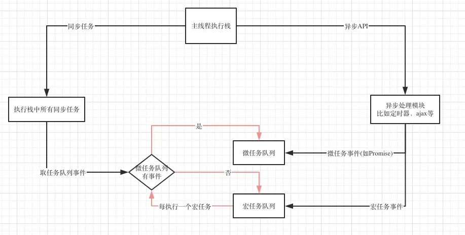

# 前端工程化

<!-- 依据业务特点，将前端开发的规范、流程、技术、工具形成一种标准体系

通过工程化、自动化工具来提升效率

环境、技术选择、规范、预处理、项目打包、代码整合清理、转换、压缩、合并

热更新、代码校验、自动发布、版本管理

形成流水线

构建其实就是 工程化 自动化 -->


- 前端工程化是把软件工程的概念用于前端开发，
- 为了提高开发的效率、提升质量、降低开发难度
- 包括一系列流程如：自动化构建、模块化、组件化开发、前后端分离、部署、性能优化等

## 模块化

一个模块就是一个实现特定功能的文件

模块化的优点：
- 易用性，需要什么模块则加载什么模块
- 高内聚低耦合
- 避免全局污染
- 代码复用
- 模块打包
- 便于维护升级

JS 模块化方案：
- ES6 模块化方案 import + export default {}
- CommonJS 同步加载，每个模块单独作用域 module.eports + require
- AMD 异步加载，define 定义，require 加载 (requireJS)
- CMD 一个模块就是一个文件

CSS 模块化
- BEM 命名规范 class
```css
block__element--modify {
  ...
}
```

## 组件化
- 对 UI 的拆分，把 UI 界面视为一个容器，里面盛放了各种组件
- 每个组件都是独立的 模板html + 样式css + 逻辑js
- 如一个页面分为 header + content + footer，还可以往下细分

组件化好处：
- 复用
- 各个组件之间可以组合

# 前端构建
> 自动化处理需要反复重复的任务，例如压缩（minification）、编译、单元测试、linting 等，还有强大的插件生态。

grunt -> gulp + browserify -> webpack

webpack 搭配 react/vue/Angular 成为最佳选择, 至此前端开发离不开 webpack, webpack 真正成为前端工程化的核心

rollup 主要针对 JavaScript，类库      
webpack 针对整个前端工程

## webpack 主要模块
- 核心流程
- loader
- plugins

## 配置
```js
module.exports = {
  entry: '',                 // 入口
  output: '',
  resolve,                  // 解析模块依赖的自定义项,
  module,                   // rules
  plugin
}
```

## 优化
1. 组件热刷新、CSS热刷新
2. node_modules 缓存
3. 构建中间结果缓存 （loader处理结果、plugin处理结果、输出文件结果）
4. TreeShaking (依赖于 ESModule，编译阶段)


# 浏览器原理
> 浏览器主要功能就是向服务器发起请求，在浏览器窗口显示资源，资源位置由 uri 指定

1. 浏览器分类
Trident 引擎：IE
Webkit 引擎：Chrome 、Safari
Gecko 引擎：FF

2. 浏览器组成部分
- 用户界面------------地址栏、前进后退、书签
- 浏览器引擎----------在用户界面和渲染引擎之间传递指令
- 渲染引擎------------接受网络请求的资源 HTML 等，解析并渲染
- 网络----------------网络请求 HTTP 等
- Javascript 引擎-----解析和执行 js 代码
- 数据存储------------cookie、localStorage

3. 渲染引擎
解析过程：
> 按顺序，从上到下 加载
- 解析 HTML 代码，构建 DOM 树
- 解析 CSS 代码，构建 CSSOM
- JavaScript 引擎解析 js 代码
- 构建渲染树（当遇到 img 等静态资源请求时，不会中断渲染，服务器返回图片时，需要重新渲染）
- 准备布局处理
- 绘制页面

4. 页面加载过程
- 输入 url
- 缓存判断，强缓存 到 协商缓存，首次访问或者缓存过期，重新请求
- DNS 解析
  - 搜索浏览器自身缓存的 DNS
  - 没有或过期，则搜索 系统的 hosts 文件，hosts 文件是本机缓存的 域名和 ip 对应，可以自己指定
  - 向 域名解析服务器请求解析，从根服务器向下递归、迭代解析
  - 获取 ip 地址
- TCP 请求（三次握手等）
- HTTP 请求
- 服务器收到请求，发出响应
- 服务器根据 请求头 决定是否关闭 TCP 连接（keep-alive ？），关闭则四次挥手
- 浏览器接受响应数据，解码
- 解析 DOM、CSSOM(css 规则树)、js 解析
- 渲染页面
- 静态资源请求并加载


# MVVM && MVC

MVVM 是近几年流行的一种前端框架的设计思想和架构,由 model + view + viewModel 组成

model 层是数据层，仅仅关系数据本身
view 视图层，用于数据和页面的展示
viewModel 数据和视图的映射

MVVM 架构下 view 和 model 之间没有直接的联系，而是通过 viewModel 进行双向交互，viewModel 通过双向数据绑定把 视图和模型 层连接起来，数据的变化会驱动视图更新，视图的变化也会同步更改数据

并且 Model 和 View 之间的同步是自动的，开发者只需关注业务逻辑，而无需手动进行 DOM 操作

MVC 与之相比则。。。

# 前端路由与后端路由
- 前端路由主要适用于 像 Vue 这样的 MVVM 模式的 SPA 单页应用
- 区别与传统多页应用，SPA 路由变化但页面不刷新，而是通过切换组件的形式，实现页面的改变

- 前端路由主要三种形式：hash | history | abstract
- hash 哈希路由使用 url 的哈希值作为路由，适用于各种浏览器，标志是在路由端口后面加上锚点 #
- hash 值的变化会触发 hashchange 事件，但不会提交请求，浏览器的前进后退可以控制， 在 h5 的 histor 出现前基本使用 hash

- hash 路由的问题，锚点不可用，传参不便（基于 url），# 丑

- history 路由，利用 h5 的history API （pushState | onPopState）
- 特点：url 好看像传统页面，传参方便，有历史记录，前进后退方便，
- 缺点：改变 url 会像服务器重新请求，需要服务器端配置，兼容性差


- 后端路由，根据 url 请求返回不同数据


# 浏览器兼容性问题

## CSS
1. 重置样式
reset.css | normalize.css
2. 对于 css3 的新属性，添加前缀
```css
box-sizing: border-box; 
-moz-box-sizing: border-box;                 /* 火狐浏览器 */
-webkit-box-sizing: border-box;              /* Safari, 谷歌浏览器等使用Webkit引擎的浏览器 */
-o-box-sizing: border-box;                   /* Opera浏览器(早期) */
-ms-box-sizing: border-box;                  /* IE */
```
3. 图片的默认间距
> 几个img标签放在一起的时候，有些浏览器会有默认的间距，通配符清除间距也不起作用。
float: left;
4. css hack
```css
background-color:yellow0; 0 是留给ie8的
+background-color:pink;   + ie7定了；
_background-color:orange; _专门留给神奇的ie6；
```
5. li 与 li 之间的空白
```html
<ul>
  <li>1</li>
  <li>2</li>
  <li>3</li>
</ul>
```
- 浏览器把 `inline` 元素之间的*空格、tab、换行*默认渲染成为一个空格
- 解决办法：
```css
ul { font-size: 0; }
li { font-size: 16px; }
```


## JS 兼容
1. 事件监听
```js
// IE
document.attachEvent()
// 标准浏览器
document.addEventListener('', () => {}, false)
```
例子
```js
var x = document.getElementById("myBtn");
if (x.addEventListener) {   //所有主流浏览器，ie9+
  x.addEventListener("click", myFunction);
} else if (x.attachEvent) {      // IE 8 及更早 IE 版本
  x.attachEvent("onclick", myFunction);
}
```

2. event 事件对象
```js
document.onclick = function(ev) {//谷歌火狐的写法，IE9以上支持，往下不支持；
  var e = ev;
  console.log(e);
}
document.onclick = function() {//谷歌和IE支持，火狐不支持；
  var e = event;
  console.log(e);
}
document.onclick = function(ev) {//兼容写法；
  var e = ev || window.event;
  var mouseX = e.clientX;//鼠标X轴的坐标
  var mouseY = e.clientY;//鼠标Y轴的坐标
}
```

3. 事件冒泡
```js
//js阻止事件传播，这里使用click事件为例
document.onclick = function(e) {
  var e = e || window.event;
  if (e.stopPropagation) {
    e.stopPropagation();//W3C标准
  } else {
    e.cancelBubble = true;//IE....
  }
}
```

4. 阻止默认事件
```js
//js阻止默认事件   一般阻止a链接href，form表单submit提交
document.onclick = function(e) {
  var e = e || window.event;
  if (e.preventDefault) {
    e.preventDefault();//W3C标准
  } else {
    e.returnValue = 'false';//IE..
  }
}
```

5. ajax 兼容问题
```js
if(window.XMLHttpRequest) {
  oAjax = new XMLHttpRequest();				
}else{
  //只支持IE6浏览器
  oAjax = new ActiveXObject("Microsoft.XMLHTTP");	
}
```

6. clientHeight
```js
const height = document.documentElement.clientHeight || document.body.clientHeight
```


# 前端性能优化
1. DOM 层级
2. js 及资源文件后置
3. 减少 js 操作 样式
4. 减少 内联样式 使用 class 替代
5. 注重样式的继承,减少重复样式定义
6. 懒加载预加载, 图片瀑布流
7. 按需引入
8. 打包
9. 使用缓存
10. cdn 负载均衡
11. 静态资源服务器
12. 图片使用 svg | icon-font | base64 | 雪碧图
13. 骨架屏
14. 防抖节流
15. 减少回流

## windows 前端缩放
> css 在使用 vh 单位时，IOS 下正常但 windows 笔记本 100vh 高度不正常，部分笔记本自带缩放

```css
.xxx {
  width: calc(100vw / var(--zoom));
  height: calc(100vh / var(--zoom));
}

.box {
  width: calc(100vw - 20px);
  /* 需写 成 */
  width: calc(100vw / var(--zoom) - 20px);
}
```

> js 做缩放
```js
export const detectZoom = () => {
  let ratio = 0,
    screen = window.screen,
    ua = navigator.userAgent.toLowerCase()
  if (window.devicePixelRatio !== undefined) {
    ratio = window.devicePixelRatio
  } else if (~ua.indexOf('msie')) { // IE
    if ((screen as any).deviceXDPI && (screen as any).logicalXDPI) {
      ratio = (screen as any).deviceXDPI / (screen as any).logicalXDPI
    }
  } else if (
    window.outerWidth !== undefined &&
    window.innerWidth !== undefined
  ) {
    ratio = window.outerWidth / window.innerWidth
  }
  if (ratio) {
    ratio = Math.round(ratio * 100)
  }
  return ratio
}

// 处理 windows 笔记本系统默认系统比例为 150% 带来的布局影响
// 只针对 windows 处理，其它系统暂无该情况
if (navigator.userAgent.toLowerCase().includes('windows')) {
  const m = detectZoom()
  const zoom = String(100 / Number(m))

  document.body.style.zoom = zoom
  //设置css变量值
  document.documentElement.style.setProperty('--zoom', zoom)
} else {
  document.body.style.zoom = '1'
  //设置css变量值
  document.documentElement.style.setProperty('--zoom', '1')
}
```


## 浏览器进程

现代浏览器分为两种架构：多进程、单进程

chrome 多进程：

- Browser 进程：负责处理地址栏、前进后退、书签、网络请求
- Renderer 进程：负责一个 tab 页签内所有渲染相关的所有 **最核心**
- GPU 进程：
- Plugin 进程


## Renderer 进程包含

- GUI 渲染线程：解析 HTML 构建 DOM 树，解析 CSS 构建 CSS 规则树，
- JS 引擎线程
  执行 JS 的线程，js 单线程指的就是这个线程
  这个线程与 GUI 线程互斥，长时间的同步代码执行`（while(true)）`将会阻塞渲染，导致卡顿甚至白屏卡死

- 定时触发器线程
  setTimeout | setInterval 都是在这个线程，他与 js 主线程不在同一个地方，所以单线程的js可以实现异步

- 事件触发线程
  定时器线程其实只是起到一个定时的作用，并不会在定的时间到了之后执行回调，真正执行这个回调的还是主线程；
  时间到了之后，定时器会将这个回调事件给到事件触发线程，然后事件触发线程将会将他放到事件队列当中去；
  最终 js 主线程从事件队列中读取这个回调执行；
  事件触发线程不仅会把定时器事件放入任务队列，其他满足条件的事件也是由他放入队列

- 异步 HTTP 请求线程
  这个线程负责处理异步 ajax 请求，请求完成后，也是会通知事件触发线程，事件触发线程将这个事件放入事件队列，给主线程执行


所以 js 的异步就是靠浏览器的多线程，当遇到异步任务时，就将这个任务交给对应的线程，满足条件又通过事件触发线程将这个事件放入任务队列，然后主线程从任务队列中依次取出事件继续执行。


## 事件循环

js 的主要运行环境有两个：浏览器、Node.js


### 浏览器的事件循环

1. 先区分同步任务还是异步任务
2. 同步任务直接执行，异步任务交给对应的线程，主线程继续同步任务
3. 执行异步任务的线程等到异步任务有了结果时，将异步任务回调放入事件队列
4. 主线程执行栈执行完后，读取事件队列中的回调，
5. 主线程不断循环上门的流程


> 定时器不准的问题

事件循环这个流程，最典型的问题就是：先执行同步任务，再执行事件队列中的异步任务回调

如果主线程被阻塞，异步任务的回调就会一直等待，可能导致定时器不准确


```js
const syncFunc = (startTime) => {
  const time = new Date().getTime();
  while(true) {
    if(new Date().getTime() - time > 5000) {
      break;
    }
  }
  const offset = new Date().getTime() - startTime;
  console.log(`syncFunc run, time offset: ${offset}`);
}

const asyncFunc = (startTime) => {
  setTimeout(() => {
    const offset = new Date().getTime() - startTime;
    console.log(`asyncFunc run, time offset: ${offset}`);
  }, 2000);
}

const startTime = new Date().getTime();

asyncFunc(startTime);

syncFunc(startTime);

// syncFunc run, time offset: 5007
// asyncFunc run, time offset: 5014
```

结果可见：2s 的定时器，5s 后才执行回调


## 宏任务与微任务

事件循环中的任务可以分为 宏任务和微任务，微任务的优先级高于宏任务

当事件循环遍历事件队列时，先检查微任务队列，如果里面有任务就全部拿来执行，执行完成后在执行一个宏任务

每次执行完一个宏任务后，先检查微任务队列是否有任务，有则优先执行所有的微任务




> 注意：
1. 一个事件循环中可能有多个事件队列，但是只有一个微任务队列
2. 微任务队列全部执行完会渲染一次
3. 每一个宏任务执行完也会渲染一次
4. requestAnimationFrame 处于渲染阶段，不属于宏任务或者微任务


**宏任务**
1. setTimeout / setInterval
2. setImmediate （node.js）
3. I/O (文件读取、网络请求)
4. UI 事件
5. postMessage

**微任务**
1. promise.then() catch() 等回调函数 
2. process.nextTick (node.js)
3. MutationObserver


promise 会在 setTimeout 之前执行，因为 promise 是微任务
```js
console.log('1');
setTimeout(() => {
  console.log('2');
},0);
Promise.resolve().then(() => {
  console.log('5');
})
new Promise((resolve) => {
  console.log('3');
  resolve();
}).then(() => {
  console.log('4');
})
```

执行顺序是：1、3、5、4、2


## setTimeout && setImmediate && process.nextTick && promise

- setImmediate：将事件注入到事件队列尾部，主线程同步任务和事件队列中的回调执行完毕后，立即执行

- process.nextTick：微任务，优先与宏任务（setTimeout、setImmediate）执行，且优先与其他微任务（promise.then）

setTimeout(fn, 0) 和 setImmediate(fn) 谁先执行？

同一事件循环中，触发顺序不固定，看是哪个阶段注册的
一般来说：
1. I/O （文件读取、网络请求）中 setImmediate 优先
2. 其他情况 setTimeout(fn, 0) 优先

```js
const fs = require('fs')
fd.readFile('./a.txt',  () => {
  setTimeout(() => {
    console.log('fs -> setTimeout')
  }, 0)
  setImmediate(() => {
    console.log('fs -> setImmediate')
  })
})

// fs -> setTimeout
// fs -> setImmediate
```


> 浏览器环境 HTML5 setTimeout 最小时间限制是 4ms


[](https://segmentfault.com/a/1190000023315304)

[浅谈浏览器架构、单线程js、事件循环、消息队列、宏任务和微任务](https://github.com/FrankKai/FrankKai.github.io/issues/228)
