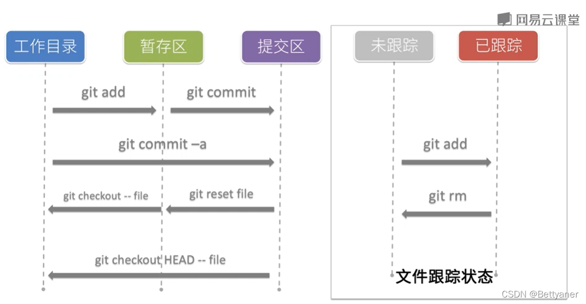

# Git
> 版本控制系统，远程托管，可以实现本地追踪、资源推送、提取修改。。

## ssh 配置
```bash
cd ~/.ssh
vim id_rsa.pub
```
复制公钥并添加到 Github/Gitlab

## git 常用命令
```bash
git init
git status
git add .
git commit -m ''
git branch -M main
git add origin git@...
git push origin -u master
```
> 其他
```git bash
git rm --cached // 从暂存区移除
git rm // 从暂存区和工作区移除

// 撤销暂存区内容
git reset HEAD <file> // 将文件内容从上次提交复制到缓存区
git reset --hard 59388e3<版本号> // HEAD 指针指回 59388e3 版本
git checkout HEAD -- <file> // 将内容从上次提交复制到工作目录

git reflog // 查看版本信息

59388e3 (HEAD -> master, origin/master, origin/HEAD) HEAD@{0}: clone: from http://xxx.git

git log // 版本详细信息
```


### 分支
1. branch
```bash
git branch // 列出所有分支
git branch -v // 查看当前分支
git branch main // 创建分支，未修改当前分支
git branch -b aaa // 创建新的 aaa 分支，并切换到 aaa
git checkout main // 切换分支到 main
git branch -m abc // 修改当前分支名为 abc
```

2. merge
```bash
git merge main
```
- 合并冲突
同一个文件中的同一个位置的修改，git 无法自动合并分支
```bash
Auto-merging hello.txt
CONFLICT (content): Merge conflict in hello.txt
Automatic merge failed; fix conflicts and then commit the result.
```
查看文件发现
```bash
something @ 11111
something @ 11111
something @ 22222222222222
something @ 11111
something @ 11111
something @ 11111
something @ 11111

<<<<<<< HEAD
something @ 333333
=======
something @ 4444444444
>>>>>>> main

something @ 22222
```

解决办法
> 删除标记及不需要的内容，并保留需要更改的内容
> 重新 add
> git commit -m 'something'
```bash
vim hello.txt
...
something @ 11111
something @ 11111
something @ 22222222222222
something @ 11111
something @ 11111
something @ 11111
something @ 11111

something @ 4444444444

something @ 22222

...

git add hello.txt
git commit -m 'merge'
```

## 远程协作
```bash
git remote add alias(like origin) https://xxxx.git  // 创建别名
git remote -v // 查看远程库别名

git push origin master -u // 推送
// -u 之后可以直接可以使用 git push 代替上面

git pull origin master // 拉取  
```
需要添加成员并同意

### forward
- git clone ssh:xxxxx
- git checkout -r 查看远程分支
- git branch 查看本地分支

### 拉取远程分支并创建本地分支
1. git checkout -b 本地分支名x origin/远程分支名
> 此种方法会在**本地新建分支x**，并**自动切换**到该本地分支x；
> 采用此种方法建立的本地分支会和远程分支**建立映射关*系*
2. git fetch origin develop:tangl
> 此种方法会在**本地新建分支x**，**不会自动切换**到该本地分支x；
> 采用此种方法建立的本地分支**不会**和远程分支**建立映射关*系*

### 本地分支和远程分支建立映射关系
git branch -u origin/分支名
或
git branch --set-upstream-to origin/分支名
(git branch --unset-upstream 撤销)

git branch -vv 查看 与远程分支的联系

## 团队外协作
pull request


## 修改项目后提交：
```
自己的分支(git push) -> gitlab (merge requests) -> new merge request
-> souce branch(自己) -> target branch(项目分支)
-> compare -> 选择 请求合并分支的 assignee
-> submit merge request
```

## 提交冲突解决：
1. 切换到源分支 git checkout test
> 如果有暂存区未提交的内容。可以使用 git stash 缓存(先 git add)，解决合并冲突后 stash pop
2. 拉取最新代码 git pull
3. 切换回自己分支
4. 合并代码 git merge test
```bash
Auto-merging src/pages/Home/index.tsx
CONFLICT (content): Merge conflict in src/pages/Home/index.tsx
Automatic merge failed; fix conflicts and then commit the result.
```
5. 进入文件解决冲突
6. 再次 add -A -> commit -> push
7. 将缓存区的文件提取出来 git stash pop

## git rm 之后恢复
git reset HEAD filename
git restore filename

## commit 之后删除不要的文件
git restore --staged filename

## push 之后想要修改 commit 内容
- git commit --amend
- 修改内容
- git push -f 覆盖提交
